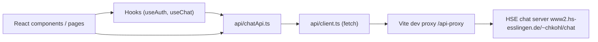
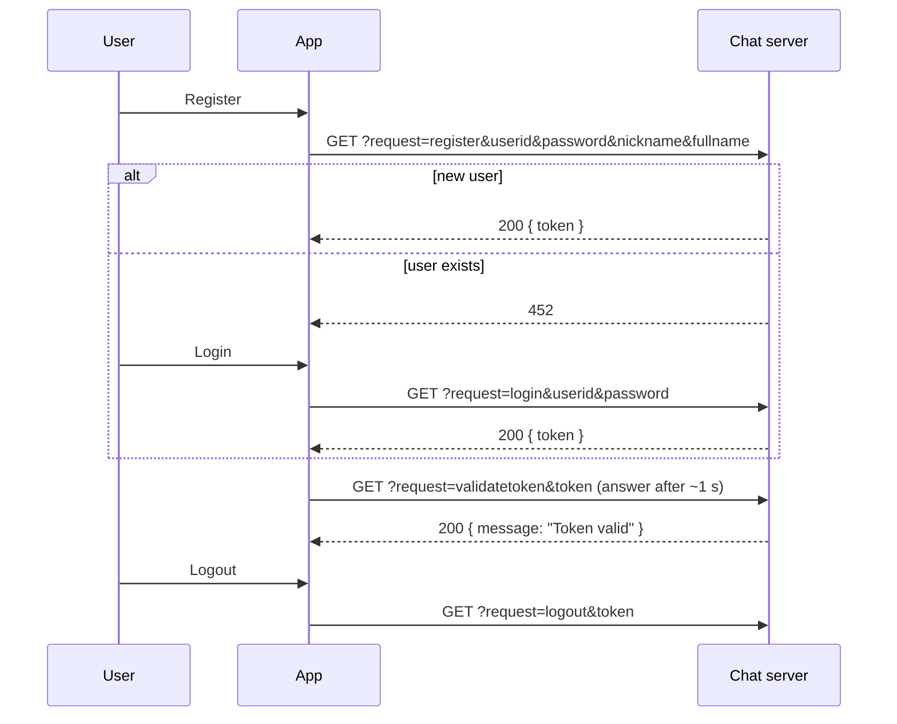

# Technical Documentation – HSE Chat Client

## 1. Purpose

Small React web app.
It talks to the HSE chat server and covers two use cases:

1. **API Test** – the four exercise steps: register, note token, validate token, interpret error codes.
2. **Chat** – a minimal chat client (rooms, messages, attachments, user list).

## 2. Architecture



| Layer | Folder | Responsibility |
|-------|--------|----------------|
| Pages | `src/pages/` | Compose components for one tab (`ApiTestPage`, `ChatPage`) |
| Components | `src/components/` | Rendering only; small, one job each |
| Hooks | `src/hooks/` | State & side effects (auth, polling) |
| API | `src/api/` | HTTP communication with the chat server |
| Types | `src/types.ts` | Shared TypeScript types + error code table |
| Utils | `src/utils/` | Generic helpers (`fileToBase64`) |

Data flows one way: **API → hooks → pages → components**. Components never call `fetch` directly.

## 3. Folder structure

```
src/
├── api/
│   ├── client.ts            # generic request(), ApiError
│   └── chatApi.ts           # one function per server command
├── hooks/
│   ├── useAuth.ts           # userId + token (localStorage), logout
│   └── useChat.ts           # rooms, messages, polling, send, createRoom
├── components/
│   ├── Header.tsx           # title, tabs, logout
│   ├── Modal.tsx            # reusable dialog
│   ├── test/                # StepCard, RegisterStep, TokenStep, ValidateStep, ErrorCodeStep
│   └── chat/                # RoomList, MessageList, MessageItem, MessageComposer
├── pages/
│   ├── ApiTestPage.tsx
│   └── ChatPage.tsx
├── utils/fileToBase64.ts
├── types.ts
├── App.tsx                  # useAuth + tab switch
├── main.tsx                 # React entry point
└── index.css                # Tailwind import + small utility classes (card, input, btn-*)
```

## 4. Communication with the chat server

The server exposes **one endpoint**. The command is chosen with the `request` parameter.

| Method | Where are the arguments? | Used for |
|--------|--------------------------|----------|
| `GET`  | query string (`?request=login&userid=…`) | every command except `postmessage` |
| `POST` | JSON body (`{ "request": "postmessage", "token": "…", … }`) | `postmessage` |

Every JSON response contains `status`, `code` and `message`. Errors are returned with the
application error code **as HTTP status** (e.g. `451`).

`api/client.ts → request()`:

1. Builds the URL (GET) or JSON body (POST).
2. Reads the response body **once** as text and parses it as JSON (falls back to plain text).
3. Throws an `ApiError` (`code` = HTTP status, `response` = parsed body) for non-2xx responses.

### Token flow



The token is stored by `useAuth` in `localStorage`, so it survives a page reload.
Logout calls `request=logout` and removes the token locally (even if the server call fails).

## 5. Exercise steps (API Test tab)

| Step | Component | Server command |
|------|-----------|----------------|
| 1 Register | `RegisterStep` | `register` / `login` (shared `authenticate()` handler) |
| 2 Note token | `TokenStep` | – (shows token + raw response) |
| 3 Validate token | `ValidateStep` | `validatetoken`, response time is measured |
| 4 Interpret errors | `ErrorCodeStep` | see below |

### Step 4 – safe error tests

Test cases are a plain array (`{ code, label, run }`). Only requests that **can never create an
account** are included:

| Code | Test | Why it is safe |
|------|------|----------------|
| 451 | register with id `invalid` | id format is rejected |
| 452 | register own user again | only enabled when logged in (account already exists) |
| 454 | login as `zzzzit99` | login never creates users |
| 455 | login with wrong password | login never creates users |
| 456 | logout with invalid token | no account involved |

Codes 453 and 466–469 (validation of a *new* registration) are listed in the reference table but
not triggered, because a mistake in the test data could register a real account.

## 6. Chat tab

- **Rooms:** `getchats`; room `0` (main chat) is always shown. New rooms via `createchat` (public).
- **Messages:** `useChat` polls `getmessages` every 3 s with `fromid = highest id received`,
  so only **new** messages are transferred. Duplicates and late responses after a room
  switch are ignored.
- **Sending:** `postmessage` (POST, JSON). Optional fields:
  - `photo` – PNG as base64 data URL
  - `file` – any file as base64 data URL
  - `position` – fixed campus location `{lat: 48.739, lon: 9.307}`
  - `important` – highlights the message
- **Attachments:** displayed via `getphoto` / `getfile` URLs directly in `` / `<a>`.
- **Users:** `getprofiles` in a modal.
- Errors are shown inline above the message list (no `alert()`).

## 7. Error codes

| Code | Meaning |
|------|---------|
| 451 | Wrong user id format (4 letters + `it` + 2 digits) |
| 452 | User already exists |
| 453 | Password too short (min. 6) |
| 454 | Unknown user |
| 455 | Wrong password |
| 456 | Invalid token |
| 457 | Invalid photo / file id |
| 458 | Invalid chat id |
| 462 | Chat name too short |
| 466 / 467 | Nickname too short / too long (2–30) |
| 468 / 469 | Full name too short / too long (2–30) |

The table lives in `src/types.ts` (`ERROR_CODES`) and is used by the UI.

## 8. Dev proxy & CORS

Browsers block cross-origin requests unless the server sends CORS headers. To avoid this,
`vite.config.ts` defines a proxy:

```ts
'/api-proxy' → 'https://www2.hs-esslingen.de/~chkohl/chat'
```

The app always calls `/api-proxy/...` (`BASE_URL` in `api/client.ts`).

> **Limitation:** the proxy only exists in `npm run dev` / `npm run preview`. A static
> production deployment needs its own reverse proxy (or a server with CORS enabled) and
> `BASE_URL` adjusted accordingly.

## 9. Known limitations / possible extensions

- Polling instead of push (the server offers no WebSocket).
- Location is a fixed campus position (could use `navigator.geolocation`).
- Invites, joining/leaving private chats and direct chats are not implemented in the UI.
- No automated tests yet (candidates: `api/client.ts`, `useChat`).
